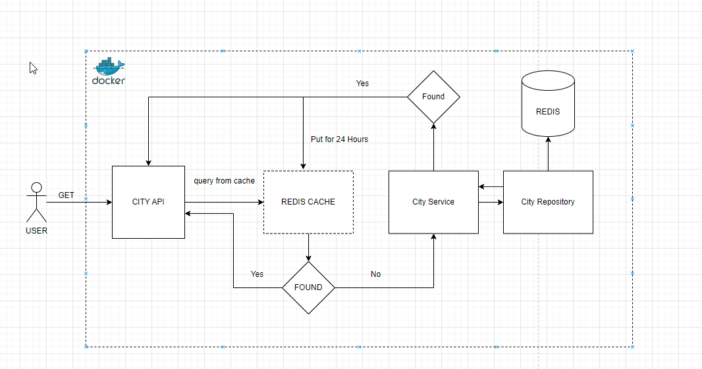

# spring redis
> Spring Boot Redis Example Implementations

### Overall Architecture


## Table of Contents
* [General Info](#general-information)
* [Technologies Used](#technologies)
* [API List](#api-list)
* [Setup](#setup)
## General Information
- In this project you can store Cities to Redis Database and Cache

## Technologies
- Spring Boot - version 2.7.9
- Java - version 8
- Lombok - version 1.18.24
- Redis - version 6.2.11

## API list
**There are 4 API endpoints;**

>[CityController](/src/main/java/tr/com/nebildev/springredis/controller/CityController.java) /api/v1/cities

- POST -> Create a City and put it on REDIS cache for 24 hours and save to Redis database.
- GET /{code} -> Check the city code on first cache after Database and if it found return the CityResponse
- GET / -> Return the all cities
- DELETE / -> Delete the city by its ID, from both cache and database.

## Setup

```sh
$ cd spring-redis
$ docker-compose up -d --build // create REDIS and spring-redis containers and run them on docker.
```